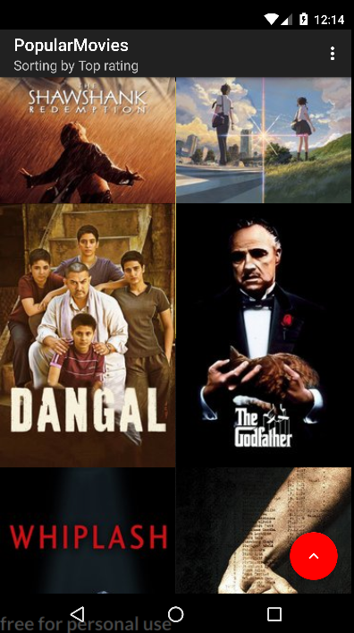
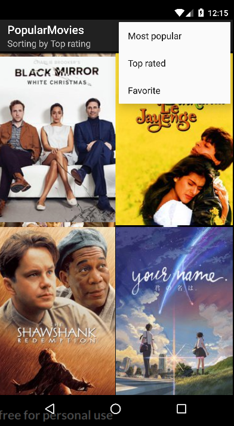
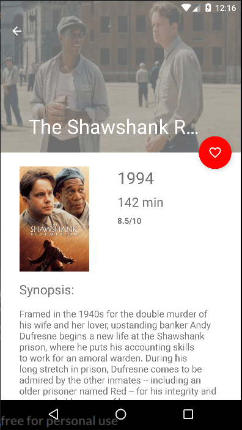
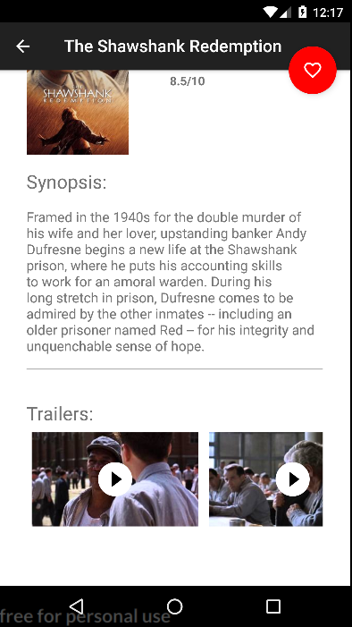
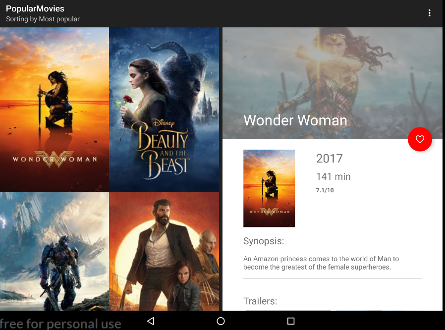

# PopularMovies-Stage-2
The project 2 in Udacity's [Android Developer Nanodegree](https://www.udacity.com/course/android-developer-nanodegree-by-google--nd801). 

## Setup

In order to run the app, You must create your own Movie DB API key.
See [here](https://www.themoviedb.org/documentation/api?language=en) for more info.
If You have crated an API key, insert your in global gradle.properties file
 
```
 MOVIE_API_KEY = "YOUR_API_KEY";

```
## Third-party Libraries
* [Butterknife](http://jakewharton.github.io/butterknife/)
* [Picasso](http://square.github.io/picasso/)
* [Facebook Stetho](http://facebook.github.io/stetho/)
* [Retrolambda](https://github.com/evant/gradle-retrolambda)

## Screenshots phone









## Screenshots tablet




## Licence

```
 Copyright (C) 2017  Andres Voitenko - project for Udacity Android Nanodegree
 
       Licensed under the Apache License, Version 2.0 (the "License");
       you may not use this file except in compliance with the License.
       You may obtain a copy of the License at
     
           http://www.apache.org/licenses/LICENSE-2.0
     
       Unless required by applicable law or agreed to in writing, software
       distributed under the License is distributed on an "AS IS" BASIS,
       WITHOUT WARRANTIES OR CONDITIONS OF ANY KIND, either express or implied.
       See the License for the specific language governing permissions and
       limitations under the License.

```
